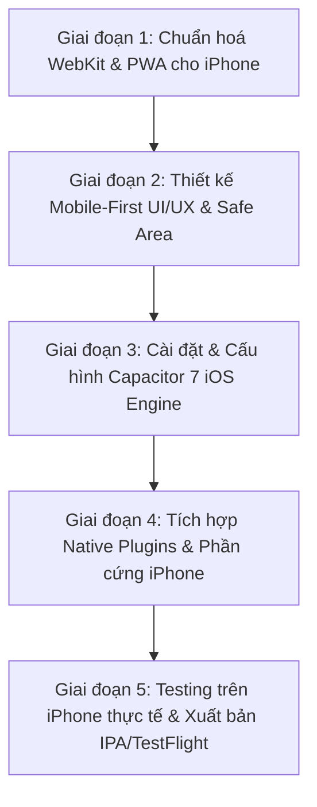

# KẾ HOẠCH NÂNG CẤP DỰ ÁN THÀNH MOBILE APP CHUYÊN NGHIỆP TỐI ƯU CHO IPHONE (iOS)

> **Mục tiêu**: Nâng cấp toàn diện nền tảng web hiện tại thành một **Ứng dụng Di động Chuẩn Mực (Native-grade Mobile App)**, tối ưu hoá chuyên sâu cho người dùng iPhone (iOS) tuân thủ tiêu chuẩn **Apple Human Interface Guidelines (HIG)**, mượt mà ở tần số quét 120Hz (ProMotion), phản hồi rung xúc giác (Haptic Feedback) và tích hợp các năng lực phần cứng của iPhone (Camera/Scanner tốc độ cao, FaceID, Chia sẻ Native, Thông báo đẩy).

---

## 1. KHẢO SÁT & ĐÁNH GIÁ HIỆN TRẠNG DỰ ÁN

### 1.1 Điểm mạnh sẵn có của hệ thống
- **Công nghệ hiện đại**: React 19, Tailwind CSS v4, TypeScript 5.8, Vite 6 cho tốc độ build và bundle tách chunk tối ưu (`vendor-react`, `vendor-charts`, `vendor-firebase`, `vendor-motion`, `vendor-icons`).
- **Kiến trúc dữ liệu Offline-First**: Toàn bộ hệ thống quản lý dữ liệu lớn (IndexedDB qua `services/dbService/`, cache nhân viên, lưu trữ phiếu in, dữ liệu bán hàng) vốn đã chạy client-side, hoàn toàn thích hợp cho môi trường mobile.
- **Có sẵn cấu trúc Mobile Navigation**: Đã có component `MobileBottomNav.tsx` (thanh điều hướng đáy) và các xử lý cơ bản `env(safe-area-inset-bottom)`.

### 1.2 Những rào cản và khoảng trống cần nâng cấp để đạt chuẩn "Professional iPhone App"
1. **Trải nghiệm Web trong Safari chưa phải là Native App**:
   - Chưa có file `manifest.json` chuẩn iOS PWA và các thẻ `<meta name="apple-mobile-web-app-...">`.
   - Thiếu bộ icon ứng dụng iOS đa kích thước (`apple-touch-icon` cho iPhone màn hình Super Retina / ProMotion).
   - Chưa có splash screen (màn hình khởi động native) tương ứng với độ phân giải các dòng iPhone (iPhone 13, 14, 15, 16 Series).
2. **Xung đột giao diện hiển thị trên iPhone (Notch & Dynamic Island & Home Indicator)**:
   - Các safe area insets (`env(safe-area-inset-top)`, `env(safe-area-inset-bottom)`) hiện đang cài cắm rời rạc ở từng component con, chưa có layout container tổng thể bao bọc.
   - Chiều cao màn hình dùng `min-h-screen` (100vh) thay vì `100dvh` (Dynamic Viewport Height), dẫn đến hiện tượng thanh công cụ Safari nhảy giật khi cuộn.
3. **Bàn phím ảo iOS (Virtual Keyboard)**:
   - Khi focus vào input có font-size nhỏ hơn 16px, Safari trên iPhone tự động phóng to (auto-zoom) toàn trang, gây vỡ bố cục và lệch khung nhìn.
   - Bàn phím ảo đẩy nội dung lên chưa có cơ chế kiểm soát mượt mà (`interactive-widget=resizes-content`).
4. **Thao tác chạm & Hiệu ứng xúc giác (Touch & Haptics)**:
   - Chưa có rung phản hồi (Haptic Feedback qua Taptic Engine) khi nhấn nút, quét mã vạch thành công hay chuyển tab.
   - Còn tồn tại độ trễ chạm 300ms tiềm ẩn ở một số phần tử nếu chưa khai báo `touch-action: manipulation`.
5. **Các bảng dữ liệu lớn (Heavy Data Tables)**:
   - Các bảng như `SummaryTable`, `WarehouseSummary`, `ContestTable`, `PivotTable` được thiết kế cho màn hình lớn. Trên iPhone (chiều rộng 375px - 430px), người dùng phải cuộn ngang liên tục rất bất tiện.
6. **Bộ nhớ RAM của Safari / WebKit giới hạn**:
   - iOS WebKit giới hạn bộ nhớ của 1 tab duyệt web (khoảng 256MB - 384MB tuỳ thiết bị). Khi mở file Excel dung lượng lớn hoặc xuất batch 50 ảnh phiếu quà tặng cùng lúc, Safari có nguy cơ bị crash reload ("A problem repeatedly occurred...").

---

## 2. LỰA CHỌN KIẾN TRÚC CÔNG NGHỆ: 3 PHƯƠNG ÁN & ĐỀ XUẤT TỐI ƯU

| Tiêu chí | Phương án 1: Viết lại Native Swift/SwiftUI | Phương án 2: Viết lại React Native / Expo | Phương án 3: **Capacitor 7 + PWA Song Hành (ĐỀ XUẤT)** |
|---|---|---|---|
| **Mã nguồn** | Phải viết lại 100% từ đầu | Phải viết lại 60-70% UI layer | **Tái sử dụng 100% codebase hiện tại** |
| **Thời gian thực hiện** | 4 - 6 tháng | 2 - 3 tháng | **1 - 2 tuần** |
| **Bảo trì sau này** | Phải duy trì 2 codebase riêng biệt (Web & iOS) | Phải duy trì 2 codebase | **Một codebase duy nhất (Sửa 1 chỗ, chạy cả Web & iPhone)** |
| **Hiệu năng trên iPhone** | Tối đa | Rất cao | **Rất mượt mà (chạy trên WKWebView Nitro Engine)** |
| **Khả năng cài đặt** | Bắt buộc đưa lên App Store | Bắt buộc đưa lên App Store | **Cài ngay lập tức qua PWA (không cần duyệt) HOẶC đóng gói file IPA / TestFlight** |
| **Năng lực phần cứng** | Toàn diện | Toàn diện | **Đầy đủ: Camera MLKit Scanner, Haptics, FaceID, Push Notification, Share Sheet** |

> ⭐️ **KẾT LUẬN CHIẾN LƯỢC**: Chọn **Phương án 3 — Kiến trúc Dual-Target (Capacitor 7 + iOS PWA)**.
> - **Cấp độ 1 (PWA iPhone First-class)**: Ngay lập tức biến web thành web-app cài thẳng vào màn hình chính iPhone (Add to Home Screen) chạy toàn màn hình không có thanh URL Safari, có icon đẹp và màn hình khởi động mượt.
> - **Cấp độ 2 (Native App Capacitor)**: Đóng gói thành Native App iOS chạy trên Xcode, cài qua TestFlight hoặc App Store với đầy đủ plugin native cao cấp.

---

## 3. CÁC HẠNG MỤC CẢI TIẾN CHUYÊN SÂU DÀNH CHO IPHONE

### 3.1 Thiết kế giao diện theo Apple Human Interface Guidelines (HIG)
1. **Quy tắc Safe Area & Tràn viền (Edge-to-Edge)**:
   - Chuyển toàn bộ gốc layout sang `min-h-[100dvh]` kết hợp padding hệ thống:
     ```css
     padding-top: env(safe-area-inset-top);
     padding-bottom: env(safe-area-inset-bottom);
     padding-left: env(safe-area-inset-left);
     padding-right: env(safe-area-inset-right);
     ```
   - Nền thanh trạng thái (Status Bar) và thanh điều khiển dưới đáy (Home Indicator) tràn viền mượt mà với hiệu ứng làm mờ kính iOS (`backdrop-blur-xl bg-white/80 dark:bg-slate-900/80`).
2. **Công thái học ngón tay cái (Thumb Zone Ergonomics)**:
   - Đưa tất cả các nút tương tác chính, nút hành động (Primary Action), nút chuyển chế độ xuống nửa dưới màn hình để dễ chạm bằng 1 tay trên iPhone màn hình to (Plus / Pro Max).
   - Kích thước vùng bấm tối thiểu đạt chuẩn Apple: **44 x 44 pt**.
3. **Modal dạng Kéo thả đáy (iOS Native Bottom Sheet)**:
   - Thay thế toàn bộ modal hộp thoại bật giữa màn hình (Desktop Center Modal) bằng **Bottom Sheet** có thanh kéo ngang (`drag handle`), cho phép vuốt nhẹ xuống để đóng modal tự nhiên như app Apple Settings, Apple Maps.
4. **Haptic Feedback (Rung xúc giác Taptic Engine)**:
   - Rung nhẹ (`ImpactFeedbackStyle.Light`) khi nhấn tab điều hướng hoặc nút bấm bộ đếm.
   - Rung xác nhận (`NotificationFeedbackType.Success`) khi quét mã vạch thành công, tải file hoàn tất, hoặc lưu cấu hình.
   - Rung cảnh báo (`NotificationFeedbackType.Warning` / `Error`) khi nhập sai mật khẩu hoặc lỗi kết nối.
5. **Xử lý triệt để Bàn phím ảo (Virtual Keyboard Handling)**:
   - Đảm bảo tất cả `<input>`, `<select>`, `<textarea>` trên mobile có `font-size: 16px` (text-base) để triệt tiêu vĩnh viễn bug tự động zoom của iOS Safari.
   - Thêm thuộc tính `inputMode="numeric"` hoặc `inputMode="decimal"` cho các ô nhập doanh thu, số lượng, mã siêu thị, thuế TNCN để iPhone tự bật bàn phím số to, không bắt user chuyển tab phím.

---

### 3.2 Tối ưu hoá từng Phân hệ Nghiệp vụ trên iPhone

#### 1. Phân hệ Sticker Event & In Tem Quà Tặng
- **Máy quét mã vạch (Barcode Scanner)**:
  - Hiện tại: Dùng `html5-qrcode` qua canvas web khiến máy bị nóng và tốn pin trên Safari.
  - Nâng cấp: Tích hợp `@capacitor-mlkit/barcode-scanning` tận dụng chip Apple Neural Engine (ANE) của iPhone để nhận diện mã vạch tức thì dưới 50ms, siêu nét trong điều kiện thiếu sáng, không giật lag.
- **In ấn & Kết nối máy in (AirPrint)**:
  - Tích hợp Apple AirPrint trực tiếp qua native printing interface, cho phép in phiếu bốc thăm/tem quà tặng từ iPhone ra máy in nhiệt LAN/Wifi mà không cần cài driver trung gian.
- **Xuất ảnh hàng loạt (Batch Export)**:
  - Khống chế việc dựng canvas nền Safari, chia nhỏ theo batch 10-20 ảnh để giải phóng bộ nhớ (garbage collection), tránh bị WebKit crash tab.

#### 2. Phân hệ Báo cáo Doanh thu & Bảng Phân Tích (Dashboard & BI)
- ~~**Chế độ Mobile Card View / Bento Card**~~ — **BỎ** (chủ dự án chốt 2026-10-02: dữ liệu dạng bảng luôn giữ là bảng, xem CLAUDE.md mục 2).
- **Bảng trên iPhone (giữ nguyên là bảng)**:
  - Bảng chi tiết: Cố định cột đầu (Tên/Mã), các cột số liệu vuốt ngang có vệt bóng mờ (`scroll shadow cue`) báo hiệu còn dữ liệu.
- **Biểu đồ Touch-Friendly**:
  - Tối ưu tooltip của Recharts: Chạm giữ ngón tay để trượt xem doanh thu từng ngày mượt mà; hỗ trợ pinch-to-zoom (thu phóng trục thời gian).
- **Bộ lọc dạng Pill Carousel**:
  - Dải chọn ngày (Hôm nay / Tuần này / Tháng này) và chọn Kho dạng hàng ngang vuốt trượt đà (`-webkit-overflow-scrolling: touch`) với chỉ số active rõ ràng.

#### 3. Phân hệ Phân Ca & Quản lý Nhân sự
- **Chế độ xem Ngày / Tuần (Day/Timeline View)**:
  - Màn hình iPhone không thể hiển thị ma trận 31 ngày của 50 nhân viên một cách trực quan.
  - Giải pháp: Thêm chế độ xem theo từng ngày: Chọn ngày trên thanh lịch trượt ngang $\rightarrow$ hiển thị danh sách nhân viên đi ca Sáng/Chiều/Tối trực quan dạng danh thiếp, có nút gọi điện/nhắn tin trực tiếp qua hotline.

#### 4. Phân hệ Tính Thuế TNCN & OCR Phiếu Lương
- **Chụp ảnh trực tiếp bằng Camera iPhone**:
  - Nút "Chụp phiếu lương" bật thẳng camera native chất lượng cao (macro focus) $\rightarrow$ tự động crop thẳng góc phiếu lương $\rightarrow$ gửi đến Gemini OCR để đọc kết quả dưới 2 giây.

#### 5. Chia sẻ Báo cáo & Bốc thăm (Native Share Sheet)
- Tích hợp **iOS UIActivityViewController** (Apple Share Sheet):
  - Người dùng bấm "Chia sẻ": iPhone lập tức mở bảng chia sẻ native của máy để gửi ảnh báo cáo / thi đua thẳng qua Zalo, LINE, AirDrop cho đồng nghiệp kế bên, hoặc lưu vào ứng dụng Files / Photos.

---

### 3.3 Tối ưu hoá Kỹ thuật & Hiệu năng WebKit (Under the Hood)
1. **Ngăn chặn triệt để hiện tượng giật rung trang (Rubber-Banding & Overscroll)**:
   - Cấu hình CSS `overscroll-behavior-y: none;` cho body và các container cuộn bên trong.
   - Sử dụng script chặn pull-to-refresh tự nhiên của Safari ở các vùng vẽ sticker.
2. **Kích hoạt ProMotion 120Hz**:
   - Sử dụng CSS `transform: translate3d(...)` và `will-change` có kiểm soát để đưa các hoạt ảnh (drawer, card flip, accordion) lên bộ xử lý đồ hoạ GPU của iPhone, bảo đảm 120fps không rớt khung hình.
3. **Cơ chế Khôi phục phiên làm việc (State Restoration)**:
   - Khi người dùng iPhone chuyển sang ứng dụng khác (Zalo, Tin nhắn) rồi quay lại, iOS có thể giải phóng RAM tab nền.
   - Hệ thống lưu trạng thái tab đang xem, bộ lọc ngày, bộ lọc kho vào `sessionStorage`/IndexedDB để khi mở lại app tức thì phục hồi đúng nguyên trạng mà không phải load lại từ đầu.

---

## 4. LỘ TRÌNH THỰC HIỆN TỪNG BƯỚC (STEP-BY-STEP ROADMAP)



### 📋 Giai đoạn 1: Chuẩn hoá WebKit & PWA cho iPhone (Thời gian dự kiến: 2 - 3 ngày)
- [x] Tạo file `public/manifest.webmanifest` chuẩn PWA với `display: standalone`. *(2026-10-01: dùng `orientation: any` thay `portrait` — bảng 48 cột cần xoay ngang; iOS vốn bỏ qua trường này, chỉ Android khoá.)*
- [x] Thiết kế và tạo bộ Icon iOS (`apple-touch-icon`) các kích thước: 180x180, 167x167, 152x152, 120x120 tại `public/icons/`.
- [x] Tạo màn hình Splash Screen native cho tất cả các dòng iPhone (iPhone 13, 14, 15, 16 Pro/Pro Max) qua media query `<link rel="apple-touch-startup-image">`.
- [x] Thêm các thẻ meta Apple trong `index.html` *(status-bar-style dùng `default`, không dùng `black-translucent` — xem chú thích trong index.html)*:
  - `<meta name="apple-mobile-web-app-capable" content="yes">`
  - `<meta name="apple-mobile-web-app-status-bar-style" content="black-translucent">`
  - `<meta name="apple-mobile-web-app-title" content="Dashboard YCX">`
- [x] Chuẩn hoá CSS: Áp dụng `min-h-dvh`, tinh chỉnh `touch-action: manipulation`. *(Chống auto-zoom: viewport đã có sẵn `maximum-scale=1` — iOS không tự phóng khi focus ô nhập nữa, nên KHÔNG ép mọi ô nhập lên 16px để khỏi vỡ các ô nhập gọn hiện có.)*

### 📋 Giai đoạn 2: Tối ưu hoá Trải nghiệm UI/UX Mobile-First (Thời gian dự kiến: 3 - 4 ngày)
> **2026-10-02: đã làm 4 đợt A→D** (chi tiết, file, test: `implementation_plan.md` các mục "iPhone Giai đoạn 2").
> Chủ dự án chốt **bỏ Giai đoạn 3–5** (native/Capacitor) — rung phản hồi (Haptic) vì thế không làm được trên web Safari.
- [x] **Đợt A** — mở lại app đúng tab/mục cũ (Report BI, In Sticker, link `?tab=`) + thẻ nhắc "Cài lên màn hình chính".
- [ ] ~~Cải tiến thanh điều hướng `MobileBottomNav.tsx`:
  - Thiết kế bo cong công thái học, hỗ trợ đầy đủ safe area đáy cho iPhone không có phím Home vật lý.
  - Thêm hiệu ứng rung nhẹ (Haptic) khi bấm đổi tab.~~ *(thanh đáy đã có safe-area từ trước; Haptic cần native — bỏ)*
- [x] **Đợt B** — KHÔNG tạo component mới: `Modal` dùng chung có sẵn `position="bottom"` → thêm thanh nắm + vuốt xuống để đóng. ~~Xây dựng Component **BottomSheetModal** (vuốt chạm đóng mở mượt mà) thay cho Modal desktop ở các màn hình:
  - Bộ lọc Tuỳ chỉnh (`FilterSection`) — *không phải modal (khối lọc nằm trong trang), không áp dụng.*
  - Hộp thoại Xuất ảnh (`ExportOptionsModal`).
  - Cấu hình thẻ KPI & Bảng thi đua.
- [x] **Đợt C** — Tối ưu hoá hiển thị bảng biểu trên màn hình hẹp (GIỮ dạng bảng — không card mode; sticky cột tên nhân viên/ngành hàng, sticky đầu bảng, viền mờ báo còn cột). *(Đầu bảng dính theo TRANG không làm được với bảng cuộn ngang — giới hạn CSS; xem implementation_plan.md.)*
- [x] **Đợt D** — bàn phím số (`inputMode`), nút "Chụp" phiếu lương mở camera, dải tab tự căn giữa mục đang chọn.

### 📋 Giai đoạn 3: Tích hợp Capacitor 7 cho iOS (Thời gian dự kiến: 2 - 3 ngày)
- [ ] Cài đặt gói Capacitor core & cli:
  ```bash
  npm install @capacitor/core @capacitor/ios
  npm install -D @capacitor/cli
  ```
- [ ] Khởi tạo dự án iOS: `npx cap init "Dashboard YCX" "vn.pro.dashboardycx"`
- [ ] Tạo thư mục native iOS: `npx cap add ios`
- [ ] Cấu hình `capacitor.config.ts` tối ưu hoá:
  - Khung nhìn WKWebView tràn viền.
  - Vô hiệu hoá phóng to thu nhỏ màn hình native.
  - Màu nền thanh trạng thái tự động theo Dark/Light mode.

### 📋 Giai đoạn 4: Tích hợp Native Plugins & Năng lực phần cứng iPhone (Thời gian dự kiến: 3 - 4 ngày)
- [ ] **Haptics Engine**: Cài đặt `@capacitor/haptics` $\rightarrow$ Gắn vào toàn bộ nút bấm quan trọng, thao tác quét mã, lưu dữ liệu.
- [ ] **Camera & Barcode Scanning**: Cài đặt `@capacitor-mlkit/barcode-scanning` $\rightarrow$ Tích hợp vào màn hình quét sticker mã vạch (tốc độ nhận diện 60fps).
- [ ] **Native Share Sheet**: Cài đặt `@capacitor/share` $\rightarrow$ Cho phép chia sẻ ảnh thi đua, nhận xét Zalo/LINE, báo cáo trực tiếp qua menu chia sẻ của iOS.
- [ ] **Bảo mật sinh trắc học FaceID**: Cài đặt `@capawesome/capacitor-fingerprint-auth` $\rightarrow$ Đăng nhập nhanh bằng FaceID/TouchID cho quản lý và nhân viên.
- [ ] **Thông báo đẩy (Local Notifications)**: Cài đặt `@capacitor/local-notifications` $\rightarrow$ Nhắc nhở chấm công, thông báo tiến độ thi đua hàng ngày.

### 📋 Giai đoạn 5: Kiểm thử thực tế trên iPhone & Đóng gói (Thời gian dự kiến: 2 ngày)
- [ ] Kiểm thử toàn diện trên trình giả lập iOS Simulator (iPhone SE, iPhone 14 Pro, iPhone 16 Pro Max).
- [ ] Kiểm thử trực tiếp trên thiết bị iPhone thật qua Safari và Xcode Runner.
- [ ] Kiểm tra mức tiêu thụ RAM, bảo đảm không bị tràn bộ nhớ WebKit khi tải file lớn.
- [ ] Đóng gói phiên bản PWA trực tiếp lên domain `https://dashboard.pro.vn/`.
- [ ] Xuất file `.ipa` hoặc cấu hình TestFlight phục vụ cài đặt nội bộ.

---

## 5. DỰ PHÒNG RỦI RO & GIẢI PHÁP KỸ THUẬT

1. **Rủi ro rò rỉ bộ nhớ (Memory Leak) khi xuất ảnh trên Safari**:
   - *Hiện tượng*: Chức năng xuất batch 50 ảnh thẻ quà tặng/tem bốc thăm có thể làm Safari tự tải lại trang do vượt quá quota RAM.
   - *Giải pháp*: Xử lý tuần tự từng ảnh với bộ đệm ẩn, huỷ bỏ object URL (`URL.revokeObjectURL`) ngay sau khi render và cưỡng chế giải phóng biến bộ nhớ giữa các batch.
2. **Rủi ro xung đột CSP (Content Security Policy) trong WKWebView**:
   - *Hiện tượng*: Một số plugin native hoặc schema nội bộ (`capacitor://localhost`) bị chặn bởi CSP web.
   - *Giải pháp*: Thiết lập origin an toàn trong `capacitor.config.ts` và tinh chỉnh `index.html` directive tương thích cả môi trường Web lẫn Native App.
3. **Độ ổn định dữ liệu Offline**:
   - *Hiện tượng*: Mất kết nối mạng khi nhân viên đang phân ca hoặc quét mã tại siêu thị.
   - *Giải pháp*: Duy trì kiến trúc IndexedDB độc lập, tự động đồng bộ lên Firebase Firestore ngay khi có sóng Wifi/4G trở lại.

---

## 6. KẾT LUẬN & ĐỀ XUẤT HÀNH ĐỘNG
Kế hoạch này đảm bảo **giữ trọn vẹn 100% logic và sức mạnh xử lý dữ liệu hiện tại**, đồng thời nâng cấp diện mạo và trải nghiệm người dùng lên tầm **Ứng dụng iPhone Đẳng Cấp Chuyên Nghiệp**. 

Khi bạn sẵn sàng triển khai, chúng ta sẽ bắt đầu thực thi tuần tự từ **Giai đoạn 1 (Chuẩn hoá PWA & WebKit iOS)** để có kết quả trải nghiệm ngay tức thì trên iPhone của bạn.
